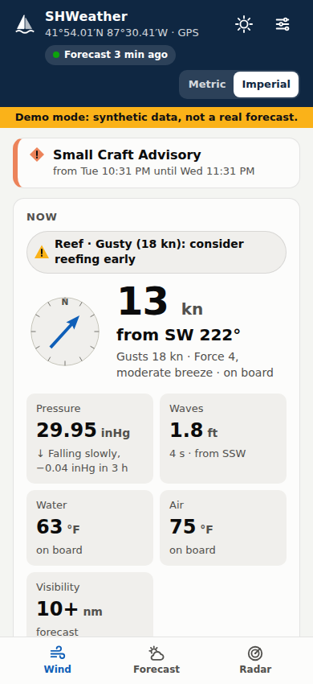
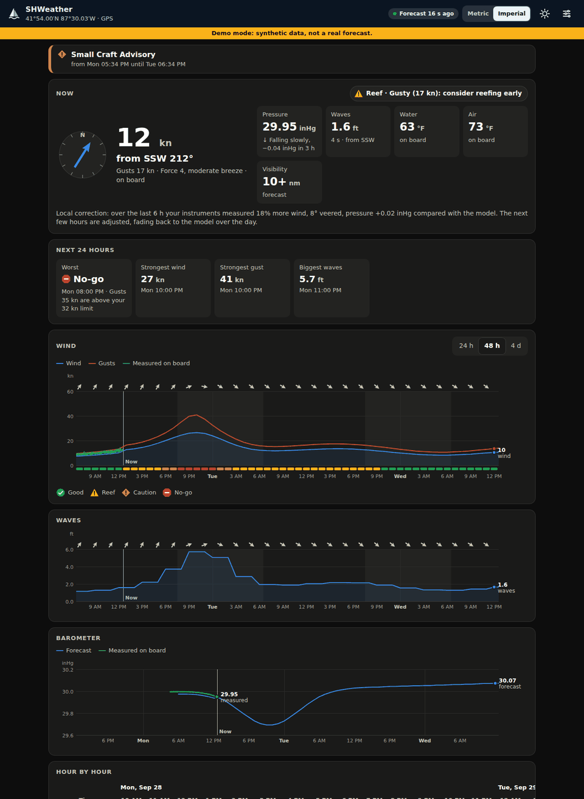
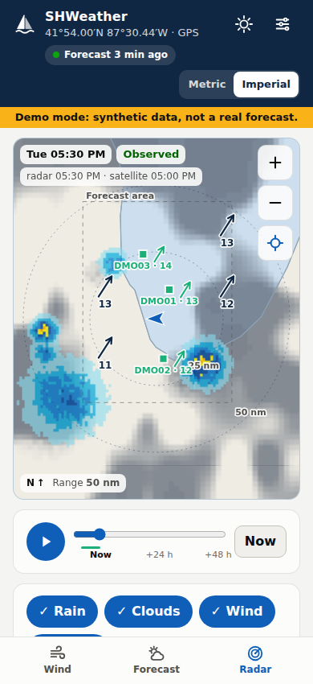
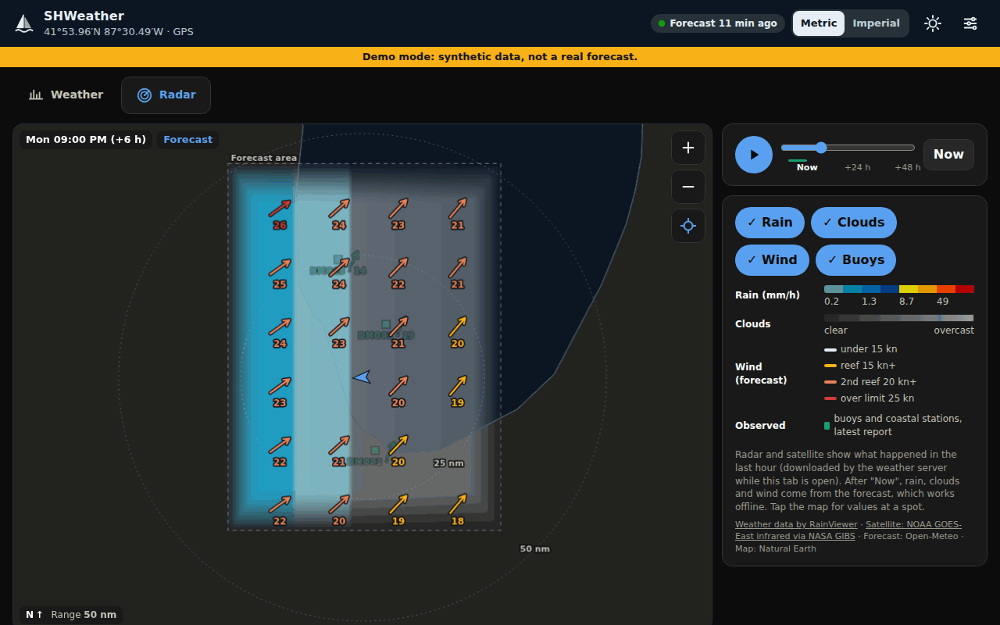

# SHWeather

**Self-hosted, offline-first marine weather for a Raspberry Pi or Windows PC aboard your boat.**

The server pulls forecasts whenever it has a connection, keeps working when it doesn't, and
blends the forecast with your own instruments to give a local, sailing-grade picture:
wind and gusts in knots, waves and swell with period, barometric tendency, squall risk,
official marine alerts, tides, and go / reef / no-go for *your* boat. Phones and tablets
on the boat's Wi-Fi open the **SHWeather** web app, with no app store and no cloud account.

<p>
  
  
</p>
<p>
  
  
</p>

> ⚠️ **Not for navigation.** Weather models are coarse near coasts and sometimes wrong.
> This software supplements, and never replaces, official forecasts, a working barometer
> and your own judgement.

## Features

- **Works offline.** Downloads a forecast grid around the boat (and optionally a whole
  passage area) and interpolates it to your GPS position for hours or days without internet.
  Every screen shows how old its data is.
- **Local correction.** Compares the last 6 hours of your anemometer and barometer with
  the model and bends the next hours towards what you actually measure.
- **Barometer tools.** 3-hour tendency with seamanship warnings ("falling quickly: gale
  possible") and a Zambretti forecast that works with no internet at all.
- **Sailing-grade data.** Sustained wind, gusts, direction, significant wave height,
  wind-sea vs swell with periods, currents, visibility, CAPE/thunderstorm risk, sea temperature.
- **Regional upgrades.** Worldwide via Open-Meteo; in US waters also NWS alerts, marine
  zone forecasts, NDBC buoys and NOAA tides/currents. On the **Great Lakes**, where ocean
  wave models don't reach, waves come from NWS forecaster grids.
- **Radar tab.** A map around the boat with the last hour of radar and satellite
  cloud pictures, then the forecast's rain, cloud and wind arrows (coloured by your reef
  limits) hour by hour for two days, plus buoy reports. The server downloads and caches
  the pictures only while the tab is open; the forecast layers and the land map work offline.
- **Your boat's limits.** Reef points and no-go limits colour every hour.
- **Bandwidth limiter.** Speed cap, daily and monthly data caps, a reserve that keeps
  safety alerts flowing when a cap is reached, and a data-saver mode for metered links.
- **Instruments.** NMEA 0183 (TCP, UDP, serial/COM ports), Signal K (bridges NMEA 2000),
  or a $5 BME280 barometer on the Pi. True wind is derived from apparent wind when needed.
- **Metric or Imperial.** One tap in the top bar switches every number in the app, with a
  Nautical option (knots, nautical miles) for either system and per-unit overrides. The
  server sets the boat's default; each phone can choose its own.
- **Cockpit UI.** Big numbers, day / dark / red night-vision themes, installable PWA.
- **Runs on a Pi or Windows.** Raspberry Pi OS / Linux as a systemd service, or Windows
  10/11 as a background service that starts at boot. One Python process + SQLite; no build
  step for the web app.

## Try it in 2 minutes (no boat, no internet)

```bash
git clone https://github.com/TylerNowak/SHWeatherService.git
cd SHWeatherService
python3 -m venv .venv && source .venv/bin/activate
pip install -e ".[dev]"
shweather serve --demo
```

On Windows (PowerShell, Python 3.11+ installed):

```powershell
git clone https://github.com/TylerNowak/SHWeatherService.git
cd SHWeatherService
py -3 -m venv .venv
.venv\Scripts\python -m pip install -e ".[dev]"
.venv\Scripts\shweather serve --demo
```

Open <http://localhost:8080>. Demo mode feeds synthetic data (a cold front crossing Lake
Michigan, a boat beating to windward) through the real parsers. The API is documented at
<http://localhost:8080/docs>.

## Install on the Raspberry Pi

```bash
git clone https://github.com/TylerNowak/SHWeatherService.git
cd SHWeatherService
sudo ./deploy/install.sh              # add --serial and/or --bme280 for those inputs
sudo nano /etc/shweather/config.yaml  # set sources.contact, home position, instruments
sudo systemctl restart shweather
```

Then browse to `http://<pi-hostname>.local:8080` from any device on the boat network.

## Install on Windows 10/11

From an **Administrator** PowerShell in the cloned folder:

```powershell
powershell -ExecutionPolicy Bypass -File deploy\windows\install.ps1
notepad C:\ProgramData\SHWeatherService\config.yaml     # sources.contact, home, instruments
powershell -ExecutionPolicy Bypass -File "C:\Program Files\SHWeatherService\deploy\windows\shweather-service.ps1" restart
```

It installs to `C:\Program Files\SHWeatherService`, keeps config, database and logs in
`C:\ProgramData\SHWeatherService`, starts at boot (no login needed), restarts itself if it
crashes, and opens the web port in Windows Defender Firewall. The installer prints the
addresses to open on your phone. Needs Python 3.11+ installed for all users
(`winget install -e --id Python.Python.3.12 --scope machine`).

See [docs/DEPLOYMENT.md](docs/DEPLOYMENT.md) (options, updates, backups, HTTPS) and
[docs/HARDWARE.md](docs/HARDWARE.md) (power, instruments, barometer, Windows hosts).

## Configuration highlights

Everything lives in one YAML file; [config.example.yaml](config.example.yaml) documents
every option. The essentials:

```yaml
sources:
  contact: you@example.com        # required by api.weather.gov
home: { lat: 41.90, lon: -87.50 } # used until a GPS fix arrives
sensors:
  pressure_altitude_m: 176        # Lake Michigan: reduce the barometer to sea level
  nmea:
    - { type: tcp, host: 192.168.1.1, port: 10110 }
bandwidth:
  max_kbps: 256                   # don't hog the cellular link
  daily_mb: 20
  saver: true
display:
  units: imperial                 # default for every phone aboard: auto, metric or imperial
  nautical: true                  # knots and nautical miles
```

Boat limits, bandwidth limits and units can also be changed from the app's Settings.

## Command line

| Command | What it does |
|---|---|
| `shweather serve [--demo]` | Web app, API, instrument inputs and background downloads |
| `shweather fetch [--lat --lon] [--radius-nm 150]` | Download once and print a summary |
| `shweather simulate --udp 127.0.0.1:10110` | Emit simulated NMEA 0183 (or `--tcp 10110`) |
| `shweather config` | Print the effective configuration |

## Documentation

- [Architecture](docs/ARCHITECTURE.md): design goals, offline strategy, nowcast, API
- [Data sources](docs/DATA_SOURCES.md): what comes from where, coverage, terms, verification status
- [Hardware](docs/HARDWARE.md): Pi or Windows PC, power, NMEA wiring, BME280, barometer altitude
- [Deployment](docs/DEPLOYMENT.md): Linux and Windows install, update, backup, HTTPS
- [Roadmap](docs/ROADMAP.md)

## Project layout

```
server/shweather/   Python package (FastAPI app, providers, sensors, analysis)
web/                PWA: plain HTML/CSS/JS modules, no build step
deploy/             Raspberry Pi install script and systemd unit
deploy/windows/     Windows installer, boot-time service supervisor, manage/uninstall scripts
tests/              pytest suite with real-format fixtures; tests/web (Node), tests/windows (pwsh)
docs/               Architecture, data sources, hardware, deployment, roadmap
```

## Contributing

Issues and pull requests are welcome; see [CONTRIBUTING.md](CONTRIBUTING.md). Run
`pytest`, `ruff check server tests` and `npm test` before sending a PR. CI runs on Linux
and Windows.

## Data attribution

Weather data by [Open-Meteo.com](https://open-meteo.com/) (CC BY 4.0; the free API is
for non-commercial use), and by the US National Weather Service, NOAA National Data Buoy
Center and NOAA CO-OPS (public domain). This project is not affiliated with any of them.

## License

[MIT](LICENSE)
